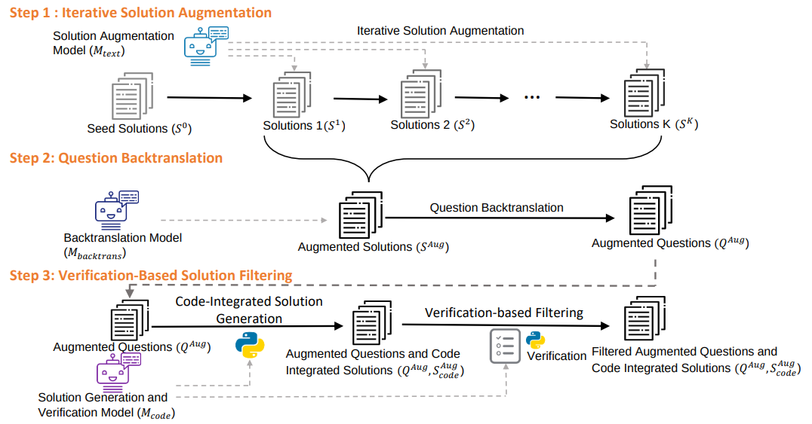
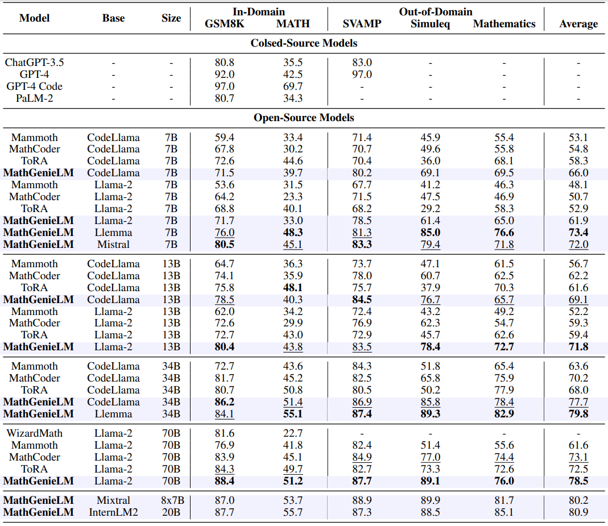

# MathGenie: Generating Synthetic Data with Question Back-translation for Enhancing Mathematical Reasoning of LLMs

This is the official repository for the paper "[MathGenie: Generating Synthetic Data with Question Back-translation for Enhancing Mathematical Reasoning of LLMs](https://arxiv.org/pdf/2402.16352.pdf)".

[[Homepage](https://mathgenie.github.io/)] [[ArXiv Paper](https://arxiv.org/pdf/2402.16352.pdf)] [[Huggingface Models](https://huggingface.co/MathGenie/MathGenie-InterLM-20B)] [[Github](https://github.com/MathGenie/MathGenie)]


## News

- **[2024-02-26]** Our paper is now accessible at [ArXiv Paper](https://arxiv.org/pdf/2402.16352.pdf).
- **[2024-03-]** Our [MathGenie-InterLM-20B](https://huggingface.co/MathGenie/MathGenie-InterLM-20B) model is available at Huggingface now.

## Introduction

Large language models (LLMs) have exhibited great potential in mathematical reasoning. However, there remains a performance gap in this area between existing open-source models and closed-source models such as GPT-4. 

In this paper, we introduce **MathGenie**, a novel method for generating diverse and reliable math problems from a small-scale problem-solution dataset (denoted as *seed data*). We augment the ground-truth solutions of our seed data and train a back-translation model to translate the augmented solutions back into new questions. Subsequently, we generate code-integrated solutions for the new questions. To ensure the correctness of the code-integrated solutions, we employ rationale-based strategy for solution verification. 

<p align="center">
     <br>
	Framework of <b>MathGenie</b>. Iterative Solution Augmentation augments human-annotated solutions in GSM8K and MATH to create new solutions, as shown in Step 1. These solutions are then back-translated to new questions using Question Back-translation, demonstrated in Step 2. Then reliable code-integrated solutions are curated using Verification-Based Solution Filtering, by generating solutions and filtering them using verification rationales, as shown in Step 3.
</p>

Various pretrained models, ranging from 7B to 70B, are trained on the newly curated data to test the effectiveness of the proposed augmentation technique, resulting in a family of models known as *MathGenieLM*. These models consistently outperform previous open-source models across five representative mathematical reasoning datasets, achieving state-of-the-art performance. In particular, MathGenieLM-InternLM2 achieves an accuracy of 87.7% on GSM8K and 55.7% on MATH, securing the best overall score among open-source language models.

<p align="center">
     <br>
  Main results of <b>MathGenieLM</b>, compared to various open-source and closed-source models on 2 in-domain datasets (GSM8K, MATH), and 3 out-of-domain datasets (SVAMP, Simuleq, Mathematics).
</p>

You can refer to the [project homepage](https://mathgenie.github.io/) and [the paper](https://arxiv.org/pdf/2402.16352.pdf) for more details.

## Usage

### Models

Our [MathGenie-InterLM-20B](https://huggingface.co/MathGenie/MathGenie-InterLM-20B) model is available at Huggingface now.

| Base Model   | Model                                                        |
| ------------ | ------------------------------------------------------------ |
| InternLM-20B | [MathGenie-InterLM-20B](https://huggingface.co/MathGenie/MathGenie-InterLM-20B) |

### Inference & Evaluation

Please refer to the [MathCoder repo](https://github.com/mathllm/MathCoder) for the detailed code for inference and evaluation of our MathGenieLM models.

## Citation

If you find this paper helpful to your research, please kindly cite this BibTex:

```
@misc{lu2024mathgenie,
			title={MathGenie: Generating Synthetic Data with Question Back-translation for Enhancing Mathematical Reasoning of LLMs}, 
      author={Zimu Lu and Aojun Zhou and Houxing Ren and Ke Wang and Weikang Shi and Junting Pan and Mingjie Zhan and Hongsheng Li},
      year={2024},
      eprint={2402.16352},
      archivePrefix={arXiv},
      primaryClass={cs.CL}
}
```

```
@inproceedings{
			wang2024mathcoder,
			title={MathCoder: Seamless Code Integration in {LLM}s for Enhanced Mathematical Reasoning},
			author={Ke Wang and Houxing Ren and Aojun Zhou and Zimu Lu and Sichun Luo and Weikang Shi and Renrui Zhang and Linqi Song and Mingjie Zhan and Hongsheng Li},
			booktitle={The Twelfth International Conference on Learning Representations},
			year={2024},
			url={https://openreview.net/forum?id=z8TW0ttBPp}
}
```